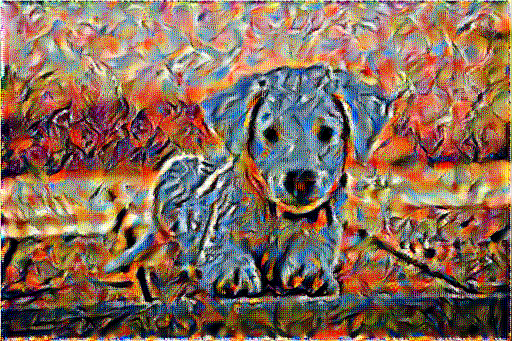

# Neural Style Transfer with InceptionV3

  
*Beautiful artistic results using InceptionV3 instead of the usual VGG19*

## Overview

This project is a clean, from-scratch implementation of the classic **Neural Style Transfer** technique (Gatys et al., 2015) built entirely in **TensorFlow 2 / Keras**.

The main twist: **we replace the ubiquitous VGG19 backbone with InceptionV3** as the feature extractor.

### Why InceptionV3?
- Richer and more diverse feature representations thanks to inception modules
- Significantly fewer parameters in early layers → faster forward passes
- Early style layers produce vivid textures and bold colors
- Late layers still capture strong semantic content
- Surprisingly beautiful and unique results compared to the standard VGG19 approach

The entire optimization loop, loss functions, Gram matrices, and image updates are implemented manually — no external NST libraries used.

## Key Features

- Pure TensorFlow 2 implementation
- InceptionV3 (ImageNet-pretrained, include_top=False) as feature extractor
- Content layer: `conv2d_88` (deep, high-level semantics)
- Style layers: first five Conv2D blocks (`conv2d` → `conv2d_4`) for strong texture capture
- Gram-matrix-based style loss
- Standard L2 content loss (scaled by 0.5)
- Adam optimizer with exponential learning rate decay
- Pixel clipping to [0, 255] after every step
- Real-time progress display + image history for GIF export

## Architecture Overview

```text
                Content Image
                     ↓
            Preprocess (-1 to +1)
                     ↓
              InceptionV3
           /             \
   Style Features       Content Features
(conv2d → conv2d_4)     (conv2d_88)
          ↓                    ↓
     Gram Matrices         Raw Activations
          ↓                    ↓
     Style Loss             Content Loss
          \                  /
           \                /
            Total Loss = α × L_content + β × L_style
                     ↓
              Gradient Descent on Input Image
                     ↓
              Repeat 1000+ steps
